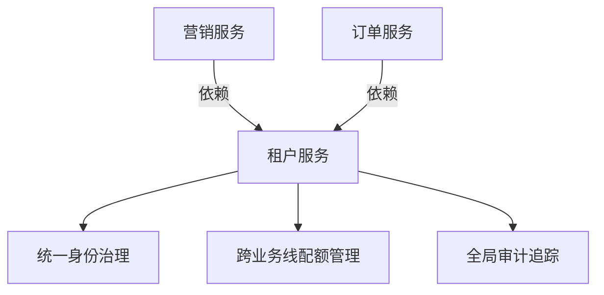
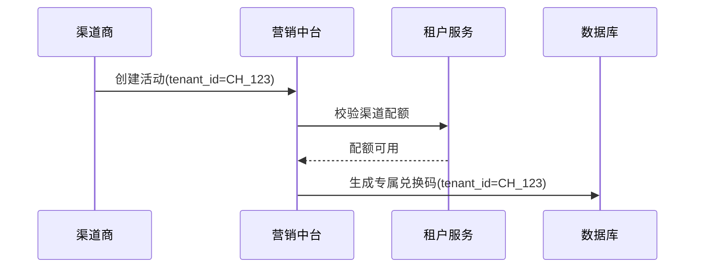
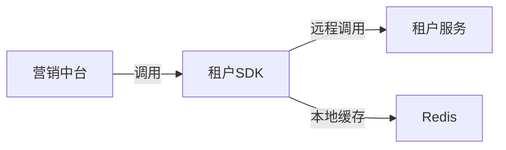

tenant-service
租户服务

## 一、租户服务的独立性决策

1. 独立租户服务的必要性



应独立部署的场景：

- 需要跨多个业务中台（营销/订单/用户）共享租户模型
- 存在复杂的租户层级结构（如：平台>代理商>商户）
- 需要实现 SaaS 化能力（多租户控制台）

## 二、渠道与租户的模型设计

1. 渠道分类建模方案

| 渠道类型   | 对应租户模型                       | 数据隔离要求       | 示例               |
| ---------- | ---------------------------------- | ------------------ | ------------------ |
| 自有产品线 | 固定租户（tenant_type=product）    | 高（完全隔离）     | APP_A、WEB_B       |
| 分销渠道   | 动态租户（tenant_type=channel）    | 中（部分数据共享） | 京东店铺、抖音小店 |
| 企业客户   | 客户租户（tenant_type=enterprise） | 定制化             | SaaS 客户企业账号  |


3. 渠道营销场景示例



## 三、实现方案

1. 关键接口设计

```go
service TenantService {
    rpc CreateTenant (CreateReq) returns (Tenant);
    rpc ListProducts (TenantFilter) returns (ProductList);
    rpc CheckQuota (QuotaReq) returns (QuotaStatus);
}

service MarketingService {
    rpc CreateCampaign (CampaignReq) returns (Campaign) {
        option (tenant_check) = true; // 接口级租户校验
    }
}

```

2. 性能优化技巧

租户缓存：在营销服务本地缓存租户基础信息

```go

// 本地缓存租户状态
type TenantCache struct {
    validTenants sync.Map // map[tenantID]bool
}

```

批量校验：兑换码批量核销时预加载租户白名单

## 四、实施路线图

1. Phase 1 - 基础能力

- 租户服务提供基础 CRUD
- 营销服务硬编码产品线租户

2. Phase 2 - 渠道扩展

- 增加渠道类型租户
- 实现配额管理 SDK

3. Phase 3 - 生态开放

- 租户自助控制台
- 多级分销商支持

## 五、注意事项：

渠道建模为特殊租户 需注意：

- 在租户表中增加 channel_properties JSON 字段
- 渠道专属配额与通用租户区分

## 六、营销中台集成方式：



cd /Users/gaoyong/Documents/work/xinyuan_tech/middleground/tenant-service && protoc --proto_path=. --proto_path=./third_party --go_out=paths=source_relative:. --go-grpc_out=paths=source_relative:. --go-http_out=paths=source_relative:. api/tenant/v1/tenant.proto
